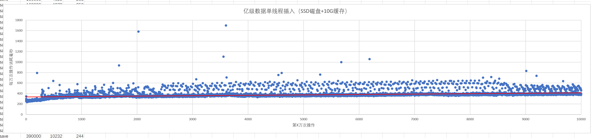
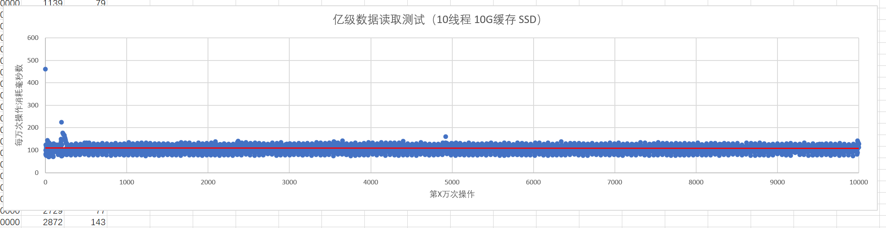
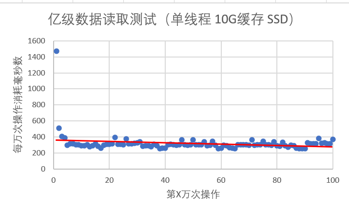

## 最终目标：分布式文件系统

### 20250303：目前进度：本地目录系统完成
本地目录系统基于B+树完成目录结构的组织，
每一个文件夹都有一个B+树存储子文件，
通过统一存储块分配降低B+树初始化的开销。
目前采用共享锁来解决多线程问题。
  
相较于系统目录（测试机器为windows）有两个明显优势：
 
1.任意文件夹下可以有无限多的子文件/文件夹，性能不会有明显降低
 2.效率高一些，使用java File扫描测试机D盘内所有文件
（大概13万个文件）最少需要3秒，
导入hc本地目录系统后完成扫描测试需1秒左右就够了
 
#### B+树性能测试： 
插入一亿条随机数据，每万次插入记录一个时间
 （测试条件: key大概25-30个字节，完全随机，value大于100字节）

在之前插入的数据集内测试多线程（10个线程，一共读取一亿次，每万次读取记录时间）读取：

在之前插入的数据集内测试单线程读取(100万次操作一共)：

